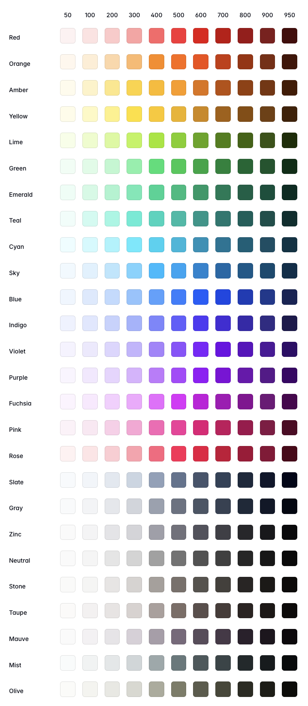

# Запуск проекта

git pull
npm i
npm run dev

Изменения в коде применяются мгновенно без перезапуска контейнера.
Приложение доступно по адресу: http://localhost:3000

Глобальные стили (цвета, шрифты) находятся в `app/assets/main.css` — там можно менять CSS-переменные.
Стили отдельных страниц и компонентов меняются прямо в `.vue`-файлах.

Каждый `.vue`-файл состоит из трёх секций:
- `<template>` — HTML-разметка
- `<script>` — логика на JS/TS
- `<style>` — стили компонента (опционально)

## Доступ

| Роль | Логин | Пароль | Страница |
|------|-------|--------|----------|
| Администратор | `Admin` | `KorNET` | `/admin` |
| Пользователь | регистрация | — | `/register` |

---

## Только локальная разработка (без Docker-приложения)

```bash
docker-compose up -d db   # только PostgreSQL
pnpm install
npx prisma migrate dev
npx prisma db seed
pnpm dev
```

## Tailwind цвета
Пример использования:
- Красный текст - text-red-500
- Зеленый фон - bg-green-500
- Темно-синий фон - bg-blue-900

